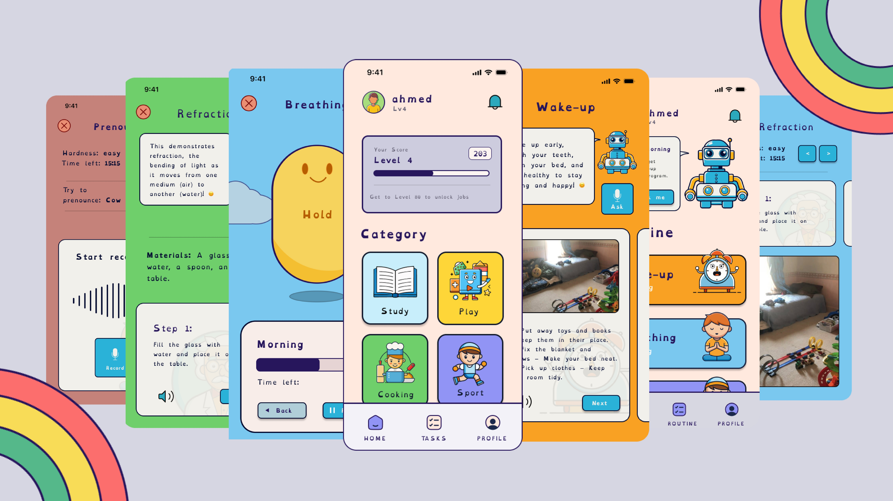

# StepWise

**StepWise** est une application éducative innovante destinée aux enfants atteints de trisomie 21, conçue pour favoriser leur **autonomie**, leur **intégration sociale** et leur **préparation professionnelle** à travers une expérience assistée par intelligence artificielle.

> ⚠️ **Remarque** : Le code source de Chic Circle est privé. Ce fichier README.md fournit un aperçu du projet et de ses fonctionnalités.

---

## 📚 Table des matières

- [🎯 Objectif](#-objectif)
- [🧠 Fonctionnalités Clés](#-fonctionnalités-clés)
- [🧠 Intelligence Artificielle (IA)](#-intelligence-artificielle-ia)
- [🛠️ Stack Technique](#️-stack-technique)
- [🎯 Cas d’usage typique](#-cas-dusage-typique)

---

## 🎯 Objectif

Permettre aux enfants trisomiques d’acquérir des compétences essentielles pour leur vie quotidienne, sociale et professionnelle, grâce à une plateforme interactive, personnalisée et accessible.

---

## 🧠 Fonctionnalités Clés

### 🧩 Catégories éducatives adaptées :
- **Spelling** : Apprentissage de la prononciation correcte grâce à la reconnaissance vocale.
- **Études** : Modules simplifiés de Mathématiques, Physique, Sciences.
- **Sport adapté** : Activités physiques simples et accessibles.
- **Pâtisserie & Cuisine** : Développement de l’autonomie culinaire pour des vocations futures.
- **Sensibilisation sociale** : Prévention contre le harcèlement, manipulation et éducation sexuelle.
- **Routines quotidiennes** : Réveil, hygiène, habillage, respiration, repas équilibrés.
- **Badges & Levels** : Système de récompenses motivant l’accomplissement des tâches.

---

## 🧠 Intelligence Artificielle (IA)

L’élément différenciateur majeur de **StepWise** est son **agent IA temps réel**

### 🧾 Agent AI en temps réel :
- Intégration avec **WebRTC** via LiveKit pour capturer et traiter la voix en continu.
- Traitement d’image en live à partir du flux caméra.
- **Détection de respiration** et validation des exercices de relaxation.
- **Génération audio** via **Speechify** (Text-to-Speech) pour une interaction vocale naturelle.

---

## 🛠️ Stack Technique

### Frontend
- **Flutter** (Dart) pour une interface responsive et accessible.
- **Push Notifications** intégrées via **WebSockets** pour communication temps réel.

### Backend
- **NestJS (Node.js, TypeScript)** :
  - Architecture modulaire et scalable.
  - Authentification, gestion des tâches, progression utilisateur.
  - WebSockets pour communication bidirectionnelle temps réel.
  - Gestion des événements et des badges utilisateur.

### AI & Traitement temps réel
- **LiveKit** : Streaming vidéo/audio temps réel pour les validations interactives.
- **Wav2Vec2** : Analyse vocale et phonétique via Deep Learning.
- **Speechify** : Conversion texte → voix pour accompagner l'enfant.
- **Gemini AI** : Agent intelligent pour valider, assister et déclencher les tâches.
- **TensorFlow / PyTorch** : Utilisés pour l'entraînement de modèles personnalisés.

---

## 🎯 Cas d’usage typique

- 🛌 L’enfant se réveille et ouvre l’application StepWise  
- 🔔 L’app lance la routine du matin :  
  - 🛏️ Faire le lit  
  - 🪥 Se brosser les dents  
  - 🌬️ Exercices de respiration  
  - 👕 S’habiller correctement  
- 🤖 Chaque étape est validée en temps réel via la caméra et le micro par l’agent AI Gemini  
- 📚 Après la routine, l’enfant accède aux activités éducatives :  
  - 🔤 Spelling avec retour vocal intelligent  
  - 🧠 Mathématiques, physique, logique  
- 🧁 L’enfant termine la journée par des tâches ludiques :  
  - 🥣 Atelier cuisine  
  - 🤸 Sport doux adapté  
- 🏅 À chaque tâche validée, l’enfant gagne un badge et progresse de niveau
  
  ---

